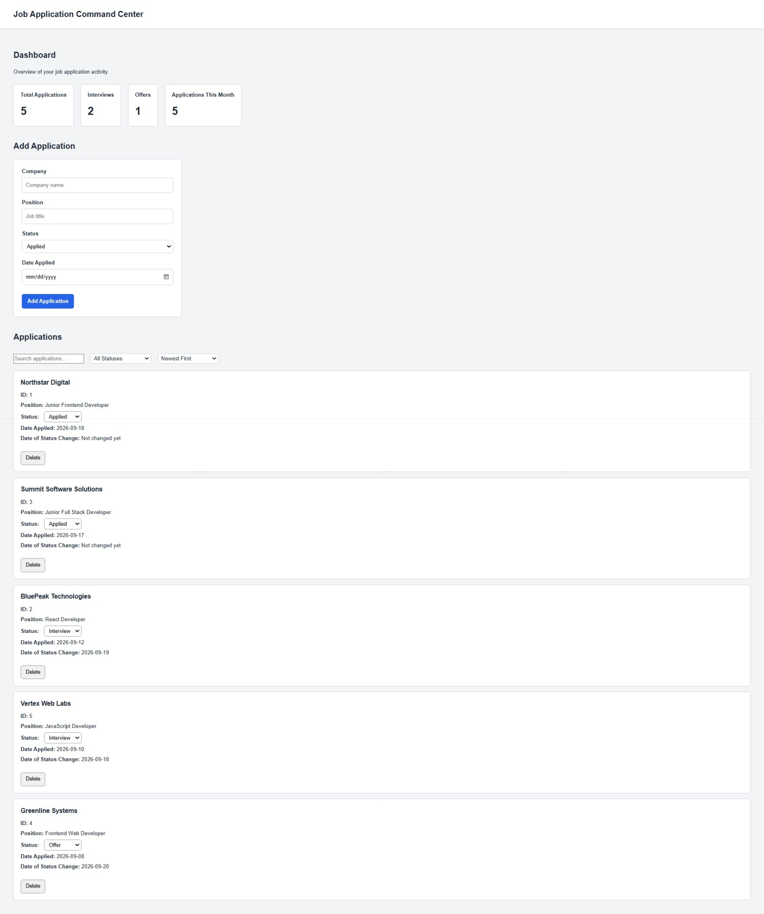
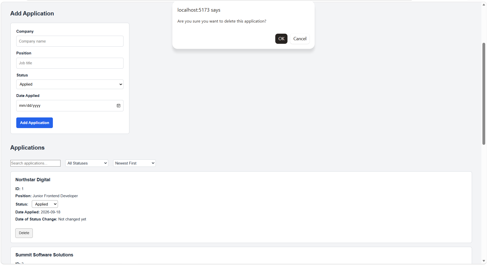
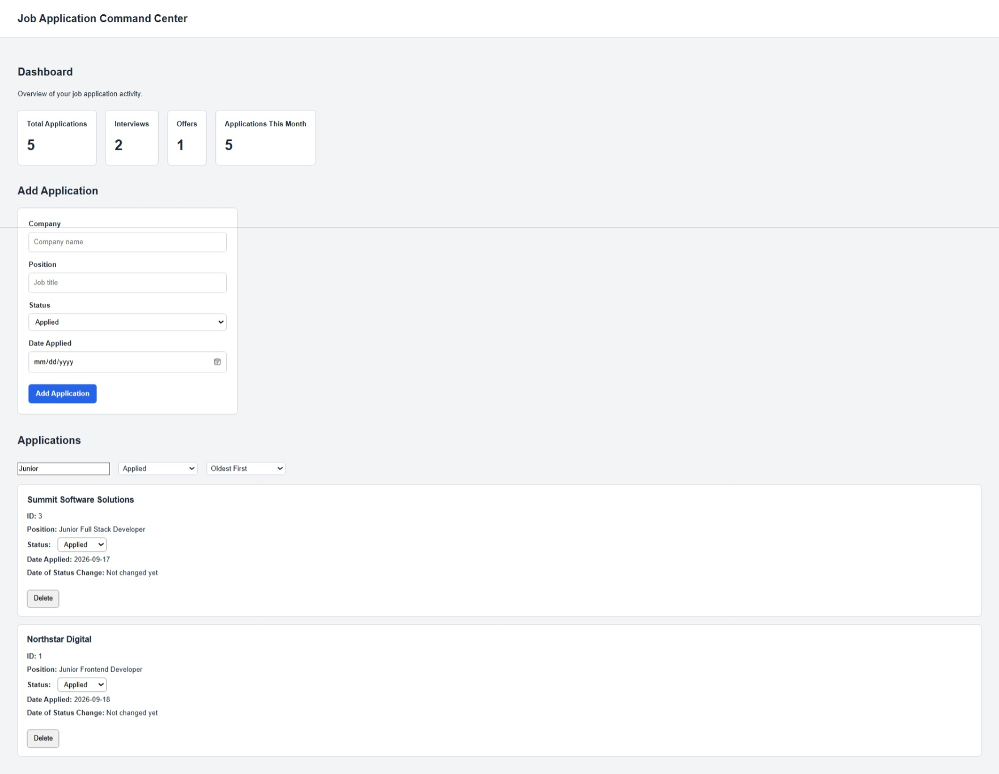
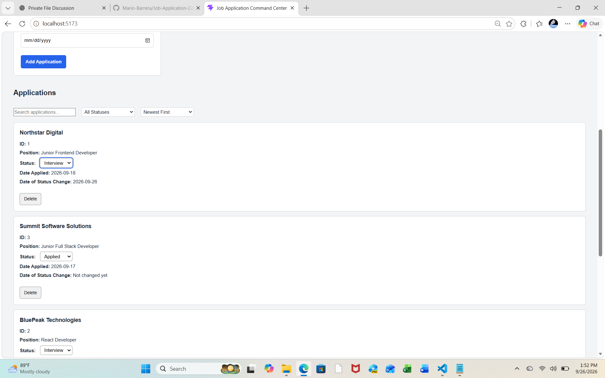

# Job Application Command Center

Job Application Command Center is a full-stack web application designed to help users organize and track job applications throughout the hiring process.

The application provides a centralized dashboard for adding applications, updating application statuses, tracking when status changes occur, searching and filtering records, sorting applications by date, and persisting application data in PostgreSQL.

This repository is a **public portfolio showcase** containing selected code examples, screenshots, and technical documentation from the project.

> The complete application source code is maintained in a private repository. Selected code samples are provided here to demonstrate the architecture, development practices, and technologies used to build the application.

---

## Project Overview

Job Application Command Center was built as a full-stack application using React and TypeScript on the frontend, Node.js and Express on the backend, and PostgreSQL for persistent data storage.

The project demonstrates a complete CRUD-oriented workflow connecting a typed React interface to a REST API and relational database.

Application records maintain the original application date while separately tracking when an application's status changes.

### Core Functionality

- Add new job applications
- Retrieve applications from PostgreSQL
- Update application status
- Track the date an application's status changes
- Preserve the original application date when status changes
- Delete applications
- Search applications
- Filter applications by status
- Sort applications by application date
- Loading-state handling
- API error handling
- Form submission feedback
- PostgreSQL data persistence
- REST API integration
- Responsive application interface

---

## Technology Stack

### Frontend

- React
- TypeScript
- Vite
- HTML5
- CSS3

### Backend

- Node.js
- Express.js
- REST APIs

### Database

- PostgreSQL
- `pg` Node.js driver

### Development Tools

- Git
- GitHub
- Visual Studio Code
- npm

---

## Application Architecture

The application follows a client-server architecture:

```text
React + TypeScript Frontend
          |
          | HTTP / REST API
          v
Node.js + Express Server
          |
          | SQL Queries
          v
PostgreSQL Database
```

The frontend manages application state and user interactions, while the Express server provides API endpoints for communicating with PostgreSQL.

Sensitive configuration values such as database credentials are stored in environment variables and are not included in this public repository.

---

## Selected Code Examples

The public examples below are curated portions of the full application. They demonstrate key frontend, backend, and database implementation patterns while the complete application source remains private. Some examples are intentionally presented as focused excerpts and are not intended to run as a standalone copy of the application.

### Frontend Examples

[Application List Interactions](./frontend-examples/application-list-interactions.tsx) – React and TypeScript component demonstrating search, status filtering, date and company sorting, status updates, delete confirmation, error handling, and conditional rendering.

[Application Form](./frontend-examples/application-form.tsx) – Controlled React form demonstrating typed state, asynchronous submission, loading state, error handling, and form reset after a successful save.

[Application Data Flow](./frontend-examples/application-data-flow.ts) – React data-management example demonstrating initial API loading, POST, PATCH, and DELETE requests, HTTP error handling, and immutable state updates.

### Backend Examples

[Application Routes](./backend-examples/applications-routes.js) – Express and PostgreSQL examples for retrieving and creating applications using asynchronous route handlers, parameterized SQL, date formatting, and structured HTTP responses.

[Status Update Route](./backend-examples/status-update-route.js) – PATCH endpoint demonstrating status validation, parameterized SQL, `400` and `404` handling, and conditional tracking of `status_changed_on` only when an application's status changes.

[Delete Application Route](./backend-examples/delete-application-route.js) – DELETE endpoint demonstrating parameterized SQL, deleted-record verification, `404` handling, and structured success and error responses.

### Database Example

[Sample PostgreSQL Schema](./database/sample-schema.sql) – Relational schema demonstrating a primary key, required fields, a default application status, original application-date storage, and independent status-change tracking.

---

## Status Tracking

Each application stores both its original application date and the date of its most recent status change.

The `date_applied` field remains unchanged when an application's status is updated, while `status_changed_on` records the date of the most recent status change.

This preserves the original application timeline while allowing status progression to be tracked independently.

---

## Screenshots

Application screenshots are located in:

[docs/images/](./docs/images/)

### Application Dashboard



### Delete Confirmation



### Search, Filter, and Sort



### Status Tracking



---

## What This Project Demonstrates

Job Application Command Center demonstrates my ability to:

- Build reusable React components
- Use TypeScript for strongly typed frontend development
- Manage React application state
- Perform asynchronous API requests
- Build Express REST endpoints
- Connect Node.js applications to PostgreSQL
- Implement CRUD operations
- Validate API input
- Handle loading and error states
- Search, filter, and sort application data
- Track application-status changes separately from the original application date
- Persist application data in a relational database
- Structure a full-stack application
- Use Git and GitHub for version control

---

## Repository Structure

```text
Job-Application-Command-Center-Showcase/
|
+-- README.md
+-- .gitignore
+-- package.json
+-- package-lock.json
+-- tsconfig.json
|
+-- docs/
|   +-- images/
|       +-- dashboard.jpeg
|       +-- delete-confirmation.png
|       +-- search-filter-sort.jpeg
|       +-- status-tracking.png
|
+-- frontend-examples/
|   +-- application-data-flow.ts
|   +-- application-form.tsx
|   +-- application-list-interactions.tsx
|
+-- backend-examples/
|   +-- applications-routes.js
|   +-- delete-application-route.js
|   +-- status-update-route.js
|
+-- database/
    +-- sample-schema.sql
```

---

## Source Code Notice

This repository is intended for **portfolio review and demonstration purposes**.

The complete Job Application Command Center application is maintained privately. Code included in this repository represents selected portions of the project intended to demonstrate development skills and technical implementation.

Unless otherwise stated, permission is not granted to copy, redistribute, sell, or incorporate the source code into another commercial project.

---

## Developer

**Mario Barrera**

Software Developer  
Fullstack Academy Web Development Bootcamp Graduate

GitHub: [Mario-Barrera](https://github.com/Mario-Barrera)